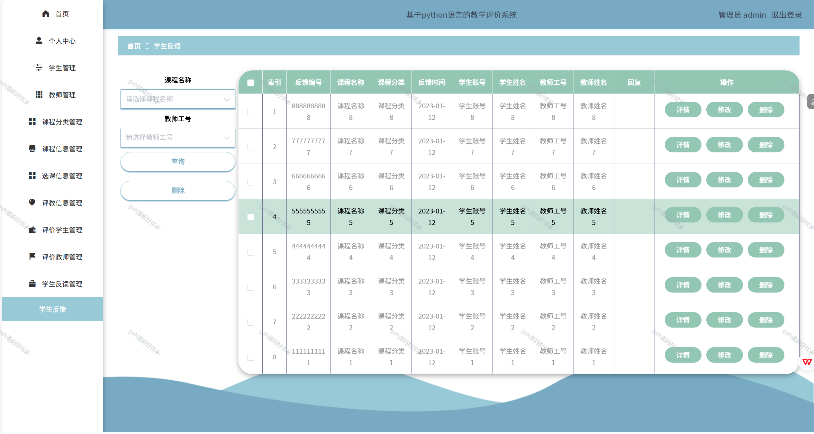

# python073
python073基于Python+Django的教学评价系统
 
## 查看主页获取源码

### 一、关键词
教学评估系统，教学测评系统，教学质量评价系统

### 二、作品包含
源码+数据库+全套环境和工具资源+本地部署教程

### 三、项目技术
前端技术：Vue2.0、Element-ui
后端技术：Python3.7、Django2.0

### 四、运行环境（以下版本亲测，其他版本兼容性请自行测试）
开发工具：PyCharm + VSCODE

数据库：MySQL5.7（最低要5.7版本）

数据库管理工具：Navicat10+

Python：Python3.7

前端Nodejs：14

浏览器：谷歌浏览器

### 五、项目介绍
项目编号：python073

教学评价系统用于全面、客观地评估教学过程与成果，以优化教学质量、提升教学效果
可管理教师（增删改查教师信息 ）、课程（分类及课程信息维护 ），还能处理选课、评教评学（记录评价数据、支持查询统计 ）及学生反馈（管理反馈及回复 ），助力教学管理与评价流程数字化。

### 六、运行截图

